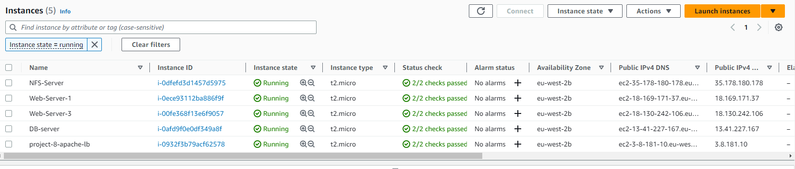
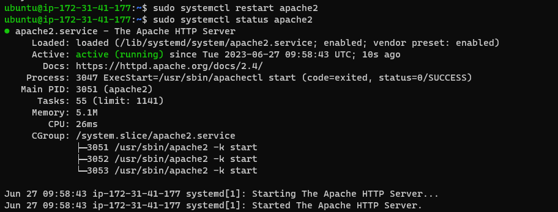
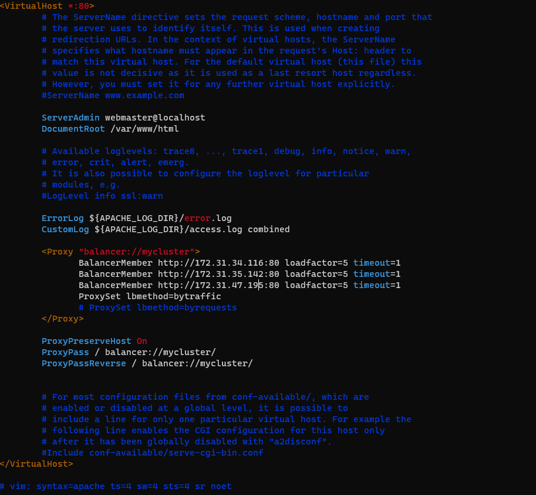
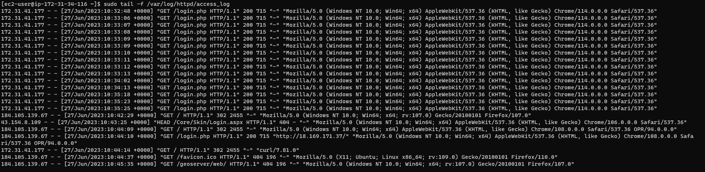
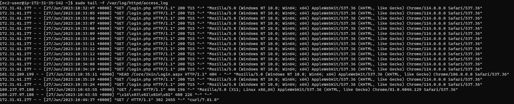
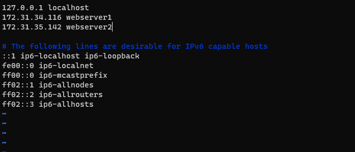
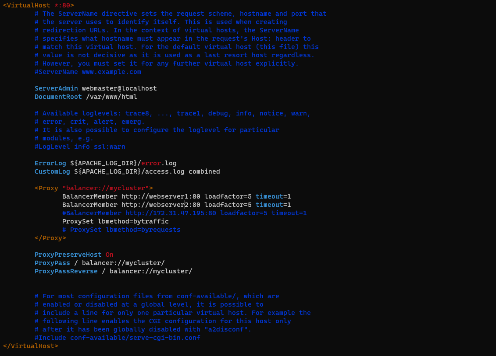
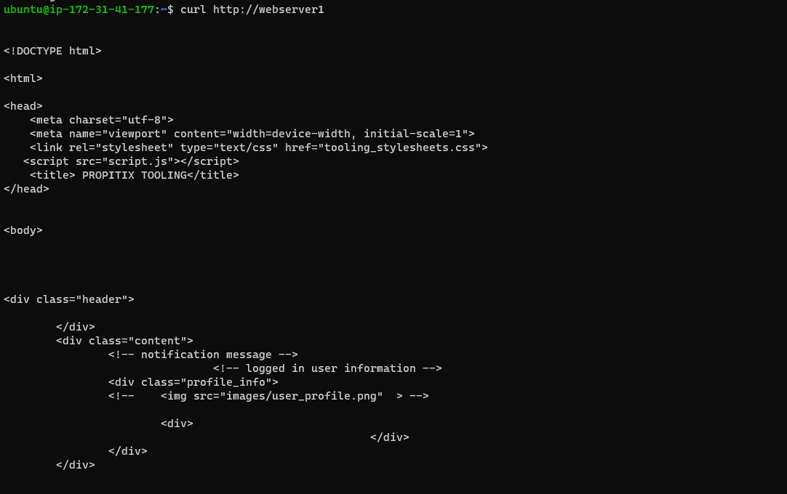
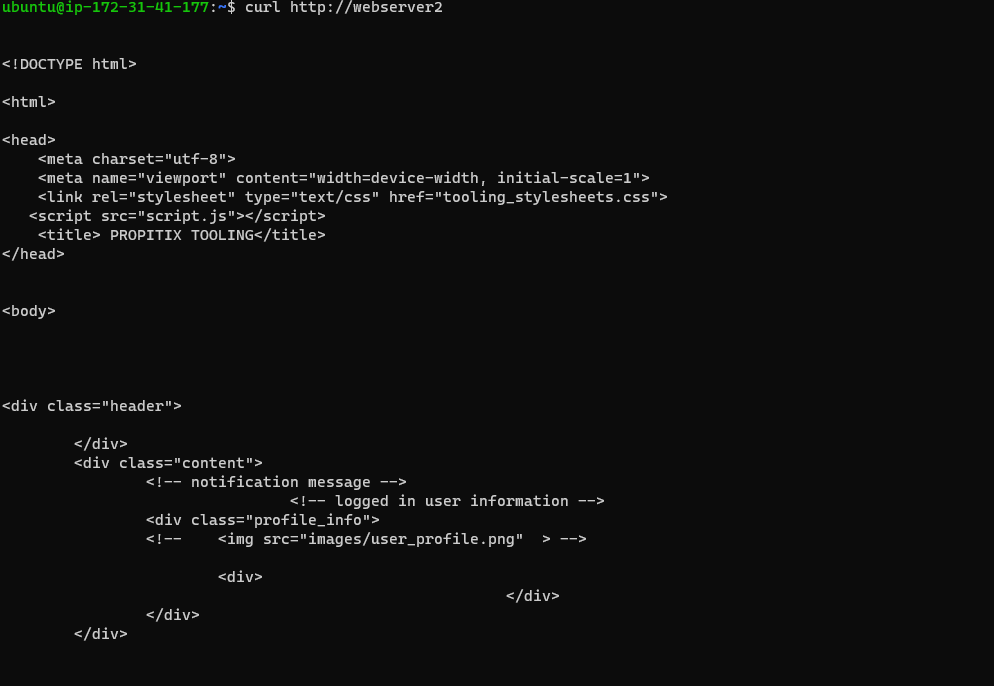

# LOAD BALANCING WITH APACHE

Following the completion of the previous project (https://github.com/nwamsamson/PROJECT_6/blob/main/project6.md), a configuration involving three separate webservers was established. Each server possesses its unique IP address, prompting inquiries regarding client accessibility and the rationale behind operating multiple servers to deliver identical content. When users navigate websites on the internet, they rely on URLs without any knowledge of the underlying server infrastructure. This intricate arrangement remains concealed from regular users. However, for immensely popular websites like Facebook or Reddit, relying solely on a single webserver becomes impracticable, as it cannot handle the enormous user traffic adequately. Consequently, this situation can lead to website crashes, and the same challenge extends to databases.

This project aims to explore the implementation of load balancing utilizing Apache. We will initiate an Apache web server dedicated to serving as a load balancer, overseeing the distribution of requests to two additional webservers hosting the tooling website from the previous project (https://github.com/nwamsamson/PROJECT_6/blob/main/project6.md).


## Implementation
Create an Ubuntu server on AWS and make sure that it is on the same subnet as the rest of the servers that have been created in the previous project (https://github.com/nwamsamson/PROJECT_6/blob/main/project6.md) 



### Installing Packages 
Apache webserver, libxml will be installed on the server and then we will need to configure apache for load balancing via enabling proxy and proxy_balancer. 

```
#Installing apache2
sudo apt update
sudo apt install apache2 -y
sudo apt-get install libxml2-dev
```

```
#Enable the following modules:
sudo a2enmod rewrite
sudo a2enmod proxy
sudo a2enmod proxy_balancer
sudo a2enmod proxy_http
sudo a2enmod headers
sudo a2enmod lbmethod_bytraffic

#Restart apache2 service
sudo systemctl restart apache2
sudo systemctl status apache2
```


### Configuring Load Balancer

The following commands are used for the apache load balacing configuration. 

```
#This command is used to open up the config file
sudo vi /etc/apache2/sites-available/000-default.conf

#This configuration into the section <VirtualHost *:80>  </VirtualHost>
<Proxy "balancer://mycluster">
               BalancerMember http://<WebServer1-Private-IP-Address>:80 loadfactor=5 timeout=1
               BalancerMember http://<WebServer2-Private-IP-Address>:80 loadfactor=5 timeout=1
               ProxySet lbmethod=bytraffic
               # ProxySet lbmethod=byrequests
        </Proxy>

        ProxyPreserveHost On
        ProxyPass / balancer://mycluster/
        ProxyPassReverse / balancer://mycluster/

#Restart apache server

sudo systemctl restart apache2
```



We take the ip address of the load balancer server and connect to it as seen below, we can see that it is serving the page from the other webservers. 


To confirm that traffic is routed evenly to both web servers as the load balancer server is receiving traffic (which in our case is by refreshing the webpage) we can check the logs both servers receive `sudo tail -f /var/log/httpd/access_log`

Server 1


Server 2


## Configuring DNS Names (Locally)

Sometimes it is tedious to remember and switch between IP addresses, especially if you have a lot of servers under your management.
What we can do, is to configure local domain name resolution. The easiest way is to use /etc/hosts file, although this approach is not very scalable, but it is very easy to configure and shows the concept well. So let us configure IP address to domain name mapping for our LoadBalancer.
```
#Open this file on your LB server

sudo vi /etc/hosts

#Add 2 records into this file with Local IP address and arbitrary name for both of your Web Servers

<WebServer1-Private-IP-Address> webserver1
<WebServer2-Private-IP-Address> webserver2
```


Now you can update your LB config file with those names instead of IP addresses.
```
BalancerMember http://webserver1:80 loadfactor=5 timeout=1
BalancerMember http://webserver2:80 loadfactor=5 timeout=1
```


Now we can curl our webservers from the load balancer locally and it'll work. Remember, this is only internal configuration and it is also local to your load balancer server, these names will neither be 'resolvable' from other servers internally nor from the internet. 



